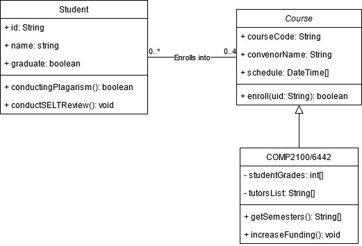

# Team Fitomatic Report - AJSMDLLZ

**Problem Statement:**  
Spending over two years in lockdown under various restrictions has made it very difficult to do two things, socialise and exercise. Our app helps promote social good by facilitating an environment that encourages an active and healthy lifestyle. Fitomatic is a social exercising app, where users are able to interact with others in an active environment. 

## Table of Contents

1. [Team Members and Roles](#team-members-and-roles)
2. [Summary of Individual Contributions](#summary-of-individual-contributions)
3. [Conflict Resolution Protocol](#conflict-resolution-protocol)
4. [Application Description](#application-description)
5. [Application UML](#application-uml)
6. [Application Design and Decisions](#application-design-and-decisions)
7. [Summary of Known Errors and Bugs](#summary-of-known-errors-and-bugs)
8. [Testing Summary](#testing-summary)
9. [Implemented Features](#implemented-features)
10. [Team Meetings](#team-meetings)

## Team Members and Roles

| UID | Name | Role |
| :--- | :----: | ---: |
| u7283219 | Shaazaan Majeed | Backend Logic, Software Testing |
| u7284728 | Deni Lanc | Backend Logic, Software Testing |
| u7284072 | Akshat Jain | Data management (Firebase) |
| u7285188 | Leon Zolati | UI Design + Development |

## Summary of Individual Contributions

u7284728, Deni Lanc, I contributed 25% of the code. Here are my contributions:
* xml files:
  * fragment_individual_post.xml 
  * fragment_small_post.xml
  * login_success_list_user.xml (Removed)
  * activity_user_profile.xml (Removed)
* SmallPostFragment.java
* LargePostFragment.java
* IndividualPostFragment.java
* UserProfile.java (Removed)
* FeedAdapter.java (Removed)
  * Was used to originally display the users on the main feed page but we changed it to posts.
* TokenizerTest.java
* MessageRecyclerAdapter.java
  * Block button handler
* RecycleFeedAdapter.java
  * Individual, Small and Large like and follow handlers
* Email.java (Removed)
  * Was a singleton design pattern but we ended up not needing it
* Report writing sections written
  * Wrote meeting minutes 2 and 3
  * Testing Summary
  * Data Structures
  * Tokenizer and Parser
  * Design Patterns

u7285188, Leon Zolati, I contribute 25% of the code. Here are my contributions:
* All xml files with the following exceptions (only small alterations made to layout and bugfix): 
  * fragment_individual_post.xml 
  * fragment_large_post.xml
  * fragment_small_post.xml
* RecycleFeedAdapter.java
* MessageRecyclerAdapter.java
* DirectMessageAdapter.java
* hostActivity.java
  * Created the bottom navigation menu and corresponding fragments and refactored old activities to work as fragments (changes made due to different life cycle of fragments, ways of getting the context, etc.)
* PostHostActivity.java
  * Created the navigation menu including scaffolding for the fragments but did not actually implement the forms front end.
* Other small additions like adding the adapters to recycleView’s
*Other contributions:*
* Use of Figma to do the following:
  * Creation of a style guide
  * Creation of Logo
  * Creation of User Flow (how a user will go through the app which pages lead to where)
  * Creation of Icons
* Created and will present the Minute Madness presentation

u7283219, Shaazaan Majeed, I contributed approximately 25% to the project. The following are my contributions:
Heavily involved with most aspects of the project. Including overall code design and implementation, report writing, software testing, proposing various design patterns and implementing a factory method.
* Code Implementation: Created the factory design pattern for standardising post creation between three concrete post classes.
  * Post.java
  * SingleActivity.java
  * SmallGroupActivity.java
  * EventActivity.java
  * PostFactory.java
* Code Implementation: Created original Tokenizer with deprecated grammar, which was expanded on by Akshat. Git commit version (https://gitlab.cecs.anu.edu.au/u7284072/comp2100-group-assignment-ajsmdllz/-/tree/a4e9d9effc0f154356f2fa11c8f167cccdbba609/app/src/main/java/com/ajsmdllz/fitomatic)
  * Token.java
  * Tokenizer.java (Removed)
  * SimpleTokenizer.java (Removed)
* Code Implementation: Software tests created
  * AVLPostsTest.java
  * MessageTest.java
  * ParserTest.java
  * PostFactory.java
  * TokenTest.java
* UI Design: Created UI elements xml files:
  * fragment_large_post.xml 
* Report writing sections written
  * Team Members and Roles
  * Conflict Resolution Protocol
  * Application design and use cases
  * Summary of known errors and bugs
  * Team meetings
* Miscellaneuos:
  * Created and maintained the group discord server for project management and team communications.

u728072, Akshat Jain, I contributed approximately 25% of the code. The following are my contributions:
* Set up and configured Firestore Database, Image Storage Database and User Authentication Database for use.
* Created all of the Peer-to-Peer Messaging mechanism from the back-end, including reading from input fields, updating the firebase, and retrieving the messages previously sent. This also included filtering blocked users. I then later worked with Leon to transfer all of this logic to Recycle Feeds so that it would fit the UI theme. The following was written by myself;
  * DirectMessage.java (excl. populateMessages)
  * MessageFragment.java
* Inspired heavily by the initial tokeniser logic created by Shaazaan, I created the full search mechanism, including the Tokeniser (with the Iterator Design Pattern), Parser (including the Grammar) and DBQuery.java which creates a Firestore Query Object. So in total, the following classes.
  * DBQuery.java
  * Expressions Folder
  * KeywordList.java (Used in Tokeniser)
  * Token.java
  * SearchParser.java
  * SearchTokenizer.java (Built from Shaazaan’s initial version)
* Storing all user data in Firestore store database in the registration phase. This also included storing the user profile picture in a separate database.
  * ChooseInterests.java (Line 31-43)
  * Registration.java
  * ProfileCreation.java (Excl. onCreate())
* Created a mechanism for querying posts from the database to be displayed on the main feed, the profile page (following posts), the user’s own posts. Similarly, also added a mechanism to retrieve all user objects for display on the message fragment.
  * PostFactory.java (createPostfromDBSnapshot & createPostfromDBQuerySnapshot)
  * HomeFragment.java (76-86, 120-125)
  * ProfileFragment.java (133-147)
  * MessageFragment.java (73-105) 
* Created the AVL tree which stores the posts queried in the database in a sequential matter (from most likes to least) in an efficient manner. Also made this data structure usable with the UI (working with Leon)
  * AVLPosts.java
  * HomeFragment.java (120-125)
* Created a mechanism to send direct notifications to a user's device using the Firebase Messaging service. This was ultimately removed as it did not contribute to our overall app design

## Conflict Resolution Protocol

A neutral third party will be agreed upon by both parties to mediate the conflict. Given that each member is responsible for different sections of the app, a mediator should be found within the group itself, however, if this is not an option, the parties can agree to have a mediator outside the group. Each party will work together with the mediator to define the conflict in their own words, constructing a single definition of the conflict. A list of positives and negatives outlining the key points of issue causing the conflict will be created. These should be considered relative to the specifications of the assignment as well as practical concerns regarding the usability and our workload. The goal of the mediation is for consensus to be achieved through compromise. If the conflict still persists, a decision will be made by a majority vote by the entire group.

## Application Description

Fitomatic is a social media application encouraging users to socialise in a group or one-on-one fitness activity. Users are able to view, follow, like and search from thousands of different posts on the home feed. These posts include the activity participants will do, when and where it will occur along with additional information. Posts are broken down into three distinct categories an individual post (one-on-one fitness activity), a small group post and a large group post targeted for big events and fundraisers.

Users first create a profile by completing their login credentials then select various active interests. Finally completing their profile with identifiable information such as name, gender, age and a description. The application involves four main fragments, the home feed, a peer to peer messaging service, create a post and profile view. From there, users can follow posts, message individuals, create their own events and view their list of following posts on their profile page. 

On the home feed, users are able to view, follow, like and search from thousands of different posts. On the peer-to-peer messaging fragment users are able to individually message other users as well as being able to block others which will remove them from the messaging view. On the post fragment, users can view their own created posts as well as create new posts. When a user creates a new post, a fragment is displayed where individual, small group or large group posts can be selected. Each post type has differences between them and with the use of a factory method, post creation is standardised. Finally, on the profile fragment, users can view their profile picture and name towards the top of the screen and view their following posts below.

Fitomatic is a gateway to socialise with others while in an active environment promoting a healthy lifestyle. 

**Application Use Cases and or Examples**

Fitomatic is targeted toward people of all ages. Individual users looking for a partner in their exercising routines or small group sporting activities as well as catering for large events directed towards fundraisers. On a social level, we want to promote physical activity for all ages. Especially for younger people, who seem to have health problems earlier on.

Timmy wants a buddy to go on afternoon runs with
* Timmy makes an individual post stating he wants a running partner who is available for afternoon runs.
* Other users can follow/like the post to get in contact with Timmy.
* After choosing a running partner Timmy can send over more details such as the location and equipment required through the peer to peer messaging service.
* After the activity concludes Timmy can keep in touch with the peer to peer messaging service or accept other users.

Steve wants to play a game of soccer with others
* Steve creates a small group post outlining where and when he would like to play soccer.
* Other users can follow/like the post to save it if they want to participate.
* Steve can now enjoy his game of soccer with the other users.
* Participants of the soccer match can keep in touch with the peer to peer messaging service to organise future plans.

Fun Run ACT wants to create a fundraising running marathon
* Fun Run ACT can create an account with appropriate verifiable credentials
* Fun Run ACT can create a large group post stating all necessary information: when, where, cost of entry for the fundraising event.
* After the fundraising marathon Fun Run ACT can contact event winners and other users who want to interact with the organisation can through the peer to peer messaging service.

## Application UML

*[Replace the above with a class diagram. You can look at how we have linked an image here as an example of how you can do it too.]*

## Application Design and Decisions
**Data Structures**
We used the following data structures in my project:
1. ArrayList
   * Objective: It is used for storing interest, posts, blocked users and following posts for our Users. It is also used for storing liked posts, followers and activities for our Posts and messages in DirectMessage.java.
   * Locations: User.java, Post.java, EventActivity.java, SmallGroupActivity.java, DirectMessage.java, PostFragment.java, ProfileFragment.java
   * Reasons:
     * Easily resizable if a user wants to like/follow a post or block a user.
     * Similarly useful for what we want out of our Posts, constantly changing values and sizes.
2. HashMap
   * Objective: It is used for our peer to peer messaging service. 
   * Locations: User.java
   * Reasons:
     * We decided to store messages as a component of the user object.
     * Hence for a given conversation with user X, we would have an arraylist of messages, Y
     * Hence, there is a natural mapping between the user email string and the messages between them. Hence, it felt natural to use a HashMap
     * It is also efficient when querying and storing message objects as user emails provide a direct and efficient indexing key to access firestore objects, and it doubles as the key of the hashmap.
3. List
   * Objective: It is used for displaying text messages through our P2P messaging system.
   * Locations: DirectMessageRecyclerAdapter.java
   * Reasons: 
     * Used to sequentially display messages so we can easily iterate over elements in the List and display them.
4. AVL Tree
   * Objective: It is used to sort the feed on the main page of the app by the number of likes a post has.
   * Locations: AVLPosts.java
   * Reasons:
     * Using a standard linear iterable type such as an array leads to O(n) time complexity for post insertion if we want the posts to be ordered from most liked to least liked. If there are n posts, this leads to a worst case scenario of O(n^2).
     * Using a tree lowers insertion time to O(log n) giving a worst case of O(n log n) which is significantly better. 
     * Hence AVL trees are a valuable addition to the application as it allows us to display posts much faster.

**Design Patterns**
We have used three design patterns namely, the factory, singleton and iterator design patterns. 

The factory design pattern is made up of classes PostFactory, SingleActivity, SmallGroupActivity, and EventActivity. It is used in the classes IndividualPostFragment, LargePostFragment, ProfileFragment, and SmallPostFragment to create a certain type of post depending on what is given to the factory method. This design pattern was chosen because it allowed deferred instantiation of a subclass, giving the ability to delegate to the relevant helper subclass. This is important when creating and retrieving posts from Firebase as PostFactory can be used to figure out what kind of post we want to store/display. 

The singleton design pattern was used in DBQuery which takes in an expression object generated by the parser and outputs a Firestore Query object to be passed into the database reference. This class essentially acts like an input handler with only one “black-box” function, which has no immediate side-effects. Hence, since its functionality does not change based on any instantiation, it made sense that we would only ever need one instance of DBQuery. So, it was implemented as a Singleton, thus saving unnecessary memory usage and increasing efficiency.

An iterator design pattern was used within the tokeniser to simplify the logic when parsing. This included a method to get the current token, go to the next token, and check if another token exists. These functions abstracted the iterative logic for checking if the input string conforms to the grammar to the tokeniser, making parsing simpler and more concise. The simplifications that this design approach provided is outlined in detail in the code smells portion. In sum, the code is much more “natural” in that it can be clearly mapped to the logic outlined in the grammar without unnecessary intermediate steps.

**Grammar(s)**

  *Production Rules*  
  \<Statement> => userExp(user, \<Activity>) | \<Activity>
  \<Activity> => ActivityQueryExp(activity, \<Activity>) | \<Fields>
  \<Field> => PostQueryExp(title, \<Fields>) | \<Time>
  \<Time> => TimeExp(date, EmptyExp) | EmptyExp

The following is the search grammar which the parsed expression must conform to. WIt is ordered by what users would naturally search for. Importantly, the users should be able to search for multiple activities and multi-worded titles. Hence, the grammar is self recursive in these two fields. If a user wants to search for a user, it seems natural that this would be the first thing they search for. Finally, the time allows users to narrow down searches further (or search for themselves in entirety) so it was placed last. The modular design of the Grammar is also easily extensible to add for more fields later if needed. This is mainly due to the fact that it is a purely linear grammar opposed to a circular one. The design is also extremely helpful when constructing the Query object as its nested structure allows queries to be built upon. Overall, the design suits the use case and is easy to use.

A downside is that due to some of the limitations of Firebase (e.g. not being able to search with OR logic instead of AND, not being able to use whereIn() for multiple fields), the design is slightly specialized towards Firebase. This reduces the modularity of our overall project. Hence, this could be fixed, however, we would need more information on the other types of systems we wish to use.

**Tokenizer and Parsers**

The tokenizer and parser is utilised when a user wants to search for a post on the main page of the app. A user is able to search for specific titles, activities, users, and time on the search bar at the top of the page. This first starts with the user entering a search string which is partitioned by word within the tokeniser. Then, for each word, a token containing the string is created by searching for specific characters (e.g. @ for users), specific words (activity names), and other attributes to get an iterable token collection. Note that this is stored in an iterator pattern as this eases the logic for constructing a grammar. These tokens are then parsed by the parser which generates an expression object which specifies how a search query should be structured. The grammar by which the parser does this is explained below. Finally, a specialised singleton class, DBQuery, is used to interpret this expression to a Firestore Query object which can simply be called.

Key advantages of our approach mainly include the separation of concerns in different stages of the search mechanism. As a result, we could try different methods of parsing, tokenizing, and query processing to optimise the process. It also increases efficiency and readability as each class in the process has a specialised role. The generalised nature of the parser further helps in querying the most relevant posts as we make use of Firestore Query’s in-built functions to iteratively build up a query from the expression.

**Surpise Item**
**Code Smells**

**Other**

**2500 Valid data instances**

Within the firestore database, we have added a total of 2500 data instances. This includes users, posts, messages, blocks, follows, user deletions and more. Hopefully this is able to 

## Summary of Known Errors and Bugs

1. Loading Profile Picture
   * There is a small delay when you start the “ProfileFragment.java” activity and the user profile picture displaying. This does not cause application issues just a minor inconvenience.
2. Following deleted posts
   * If a user follows a post and it is then deleted the user will not be able to view their profile page without the app crashing. (Note we haven’t actually implement the ability to delete posts this is just an issue if it were to be implemented)
3. Rapidly switching between the fragments in the navigation
   * If a user rapidly switches between the fragments in the bottom navigation bar, the app crashes. Is not replicated on the post creation navigation bar and so is likely an issue with firebase e.g. too many requests to handle.
4. Creating a new user and not finishing the process
   * If a user creates a new email and password but doesn’t fill out the rest of the registration and back out, the user will not be able to access their profile and other without the app crashing. This may also have consequences for other users without deleting the erroneous user.

## Testing Summary

AVLPostTest.java
  * Number of test cases: 9
  * Code coverage: Used IntelliJ Run with Coverage
  * Image:  
  
  * Types of tests created:
    * Null 
    * Height 
    * Insert 
    * Complex insert
TokenTest.java
  * Number of test cases: 18
  * Code coverage: Used IntelliJ Run with Coverage
  * Image:  
  
  * Types of tests created:
    * .getToken
    * .getType
    * Equality tests
    * toString
TokenizerTest.java
  * Number of test cases: 6
  * Code coverage: Used IntelliJ Run with Coverage
  * Image:
  
  * Types of tests created:
    * Correct title, time, user, activity and combined
PostFactory.java
  * Number of test cases: 12
  * Code coverage: Used IntelliJ Run with Coverage
  * Image:
  
    * Note: Only tested relevant fields as there are elements related to Firebase which cannot be tested.
  * Types of tests created:
    * Single, small, event and event edge cases test.
ParserTest.java
  * Number of test cases: 13
  * Code coverage: Used IntelliJ Run with Coverage
  * Image:
  
  * Types of tests created:
    * Testing simple title, time, user, activity
    * A mid case and two complex cases with multiple activities and a user, time and also using .toString
MessageTest.java
  * Number of test cases: 6
  * Code coverage: Used IntelliJ Run with Coverage
  * Image:
  
  * Types of tests created:
    * .getMessage and .getSender

## Implemented Features

*[What features have you implemented?]*

*Here is an example:*

*Privacy*
1. *Featue 1: Users may ... . (easy)*
2. *Feature 2: A user must ... . (easy)*
3. *Feature 3: A user can only ... . (medium)*

*Firebase Integration*
1. *Feature 1: Use Firebase to implement ... . (easy)*
2. *Feature 2: Use Firebase to persist ... .(medium)*

*List all features you have completed in their separate categories with their difficulty classification. If they are features that are suggested and approved, please state this somewhere as well.*

## Team Meetings

Meeting Minutes

- *[Team Meeting 0](./meetings/Meeting0_6-4-22.md)*
- *[Team Meeting 1](./meetings/Meeting1_9-4-22.md)*
- *[Team Meeting 2](./meetings/Meeting2_13-4-22.md)*
- *[Team Meeting 3](./meetings/Meeting3_18-4-22.md)*
- *[Team Meeting 4](./meetings/Meeting4_23-4-22.md)*
- *[Team Meeting 5](./meetings/Meeting5_1-5-22.md)*
- *[Team Meeting 6](./meetings/Meeting6_5-5-22.md)*
- *[Team Meeting 7](./meetings/Meeting7_16-5-22.md)*

Note: smaller informal meetings were also conducted however these did not require minutes to be taken.
